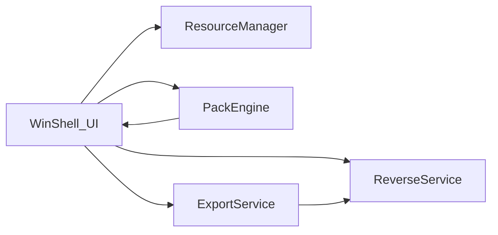

# 系统设计

## 模块边界

- **WinShell_UI**：菜单/工具栏/状态栏/Dock/画布呈现与用户事件；画布内支持平移缩放、多页总览、**分项辅助线**与选中高亮（实现见 `CanvasArea.vue` + `atlasStore`）。
- **ResourceManager**：维护图片列表、选中、缩略图与基本属性。
- **PackEngine**：根据所选算法计算布局，回写画布尺寸与精灵矩形。
- **ExportService**：离屏渲染图集、触发 JSON/PNG 下载。
- **ReverseService**：读取清单与位图，按矩形切割并交付下载。

**数据等价（与概念阶段一致）**：**离散像素图**（列表中的多张位图）与 **Atlas 描述 + 打包后的像素图（atlas + packed）** 在资源语义上等价；**Pack** 实现前者到后者的转换，**Unpack** 实现后者到前者（与 `00-concept/product-design.md` 中「图集数据等价与转换」一节一致）。

## 与物理阶段映射

构建目标 `texture-atlas-editor-spa` 对应 `frontend-vue/` 单页应用；详见 `02-physical/README.md`。

**交付面**：同一 SPA 可运行于 **浏览器**（`npm run dev` / 静态托管）、可选 **Electron**（`run.py`）、**VS Code / Cursor Webview**（`vscode-extension` 内置 `dist/`，侧栏 + 「在编辑器中打开」）。逻辑与数据流一致，宿主差异（CSP、状态栏、无新窗口）见 `02-physical/texture-atlas-editor-spa/spec.md`。
