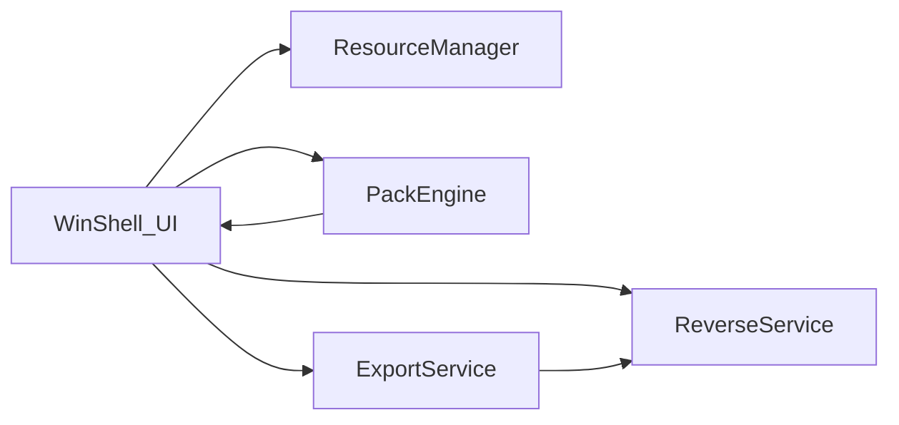

# 系统设计

## 模块边界

- **WinShell_UI**：菜单/工具栏/状态栏/Dock/画布呈现与用户事件。
- **ResourceManager**：维护图片列表、选中、缩略图与基本属性。
- **PackEngine**：根据所选算法计算布局，回写画布尺寸与精灵矩形。
- **ExportService**：离屏渲染图集、触发 JSON/PNG 下载。
- **ReverseService**：读取清单与位图，按矩形切割并交付下载。

## 与物理阶段映射

构建目标 `texture-atlas-editor-spa` 对应 `frontend-vue/` 单页应用；详见 `02-physical/README.md`。
