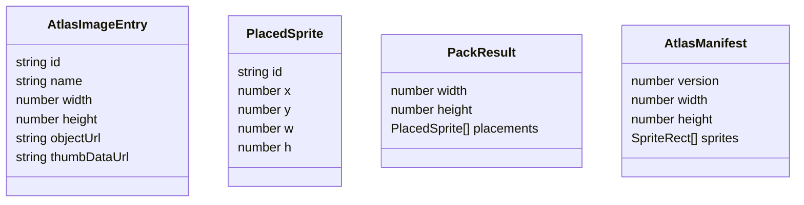

# 核心类型（逻辑视图）

```mermaid
classDiagram
  class AtlasImageEntry {
    string id
    string name
    number width
    number height
    string objectUrl
    string thumbDataUrl
  }
  class PlacedSprite {
    string id
    number x
    number y
    number w
    number h
  }
  class PackResult {
    number width
    number height
    PlacedSprite[] placements
  }
  class AtlasManifest {
    number version
    number width
    number height
    SpriteRect[] sprites
  }
```
