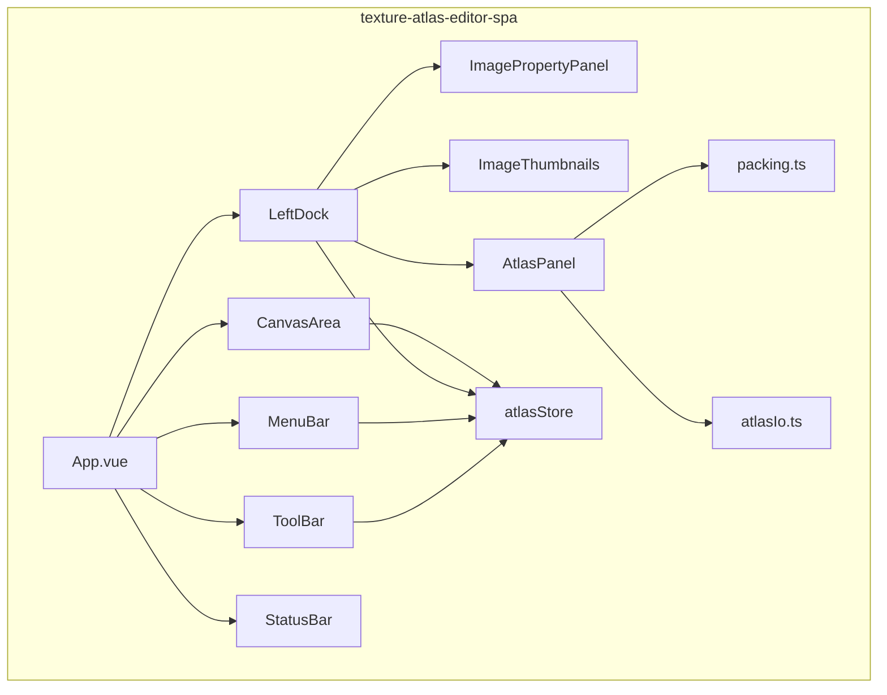

# 组件图（Mermaid）

```mermaid
flowchart TB
  subgraph spa [texture-atlas-editor-spa]
    App[App.vue]
    MB[MenuBar]
    TB[ToolBar]
    SB[StatusBar]
    LD[LeftDock]
    CA[CanvasArea]
    IP[ImagePropertyPanel]
    IT[ImageThumbnails]
    AP[AtlasPanel]
    ST[atlasStore]
    PK[packing.ts]
    IO[atlasIo.ts]
  end
  App --> MB
  App --> TB
  App --> LD
  App --> CA
  App --> SB
  LD --> IP
  LD --> IT
  LD --> AP
  CA --> ST
  LD --> ST
  MB --> ST
  TB --> ST
  AP --> PK
  AP --> IO
```
